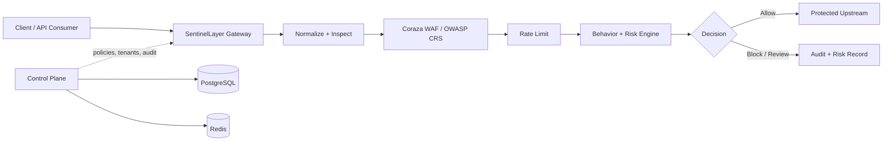

<div align="center">
  
  <h1>SentinelLayer</h1>
  <p><strong>Layered security for sensitive APIs and workflows.</strong></p>
  <p>Multi-tenant API security platform dengan gateway, WAF, behavior intelligence, risk scoring, policy safety, dan audit-ready control plane.</p>

  <p>
    <a href="https://github.com/sentinelayer/sentinelayer/actions"></a>
    <a href="https://github.com/sentinelayer/sentinelayer/blob/main/LICENSE"></a>
    <a href="https://github.com/sentinelayer/sentinelayer"></a>
  </p>
</div>

<p align="center">
  
</p>

> **Catatan kompatibilitas GitHub:** banner di atas menggunakan SVG animasi yang ringan, tanpa JavaScript atau CSS eksternal. Jika renderer tidak memutar animasi, gunakan [versi PNG statis](assets/sentinelayer-hero.png).

## The security layer between traffic and trust

SentinelLayer menyatukan enforcement dan konteks risiko dalam satu jalur request. Gateway menormalisasi traffic dan memeriksa payload; WAF, rate limiting, behavior assessment, serta risk engine membentuk keputusan; control plane menjaga tenant, policy, identity, dan audit trail.

## What is inside

| Layer | Tanggung jawab | Teknologi utama |
|---|---|---|
| **Edge gateway** | Normalisasi request, body inspection, upstream proxy, dan enforcement | Go, Coraza, OWASP CRS |
| **Threat controls** | SSRF/desync guard, rate limiting atomic, dan WAF rules | Redis, Coraza, OWASP CRS |
| **Risk intelligence** | Behavior frequency/sequence state, correlation, scoring, dan decision safety | Redis, risk pipeline |
| **Control plane** | Tenant scoping, RBAC, MFA gate, API key/session lifecycle, policy, audit events | FastAPI, PostgreSQL, Alembic |
| **Policy safety** | Versioning, approval workflow, Ed25519 metadata, dan rollback verification | Ed25519, signed metadata |
| **Operations** | Metrics, runtime events, webhook retry/DLQ, dashboard, dan maintenance worker | Prometheus, Redis, SPA |

## Request path



## Why this repository is honest about readiness

Repository dan CI evidence menunjukkan code path yang diuji; keduanya tidak otomatis membuktikan kesiapan production. Status HA, availability, calibration, false-positive rate, backup/restore, failover, dan independent security review harus dibuktikan di environment nyata.

| Saat ini tersedia | Belum boleh diklaim tanpa evidence |
|---|---|
| Unit/integration tests, Go build, Docker build, security scans, SBOM, dan E2E security checks | Technical GA, Commercial GA, certification, uptime tertentu, atau bebas insiden/false positive |
| Multi-tenant control plane dan security pipeline terintegrasi | Production HA, customer SLA, multi-region consistency, dan operational resilience |
| Policy approval, signature metadata, rollback verification, dan audit records | KMS/HSM lifecycle penuh, key rotation tanpa invalidasi terkelola, dan independent review |

## Run locally

### Requirements

Development membutuhkan **Python 3.11+**, **Node.js 22+**, **Go 1.25+**, PostgreSQL, Redis, dan Docker bila memilih Compose.

### Docker Compose

```bash
git clone https://github.com/sentinelayer/sentinelayer.git
cd sentinelayer
cp .env.example .env
# Isi secret development lokal; jangan gunakan nilai contoh untuk production.
docker compose up --build
```

### Build dan test

```bash
alembic -c alembic.ini upgrade head
npm --prefix dashboard ci
npm --prefix dashboard run build
(cd gateway && go test ./... && go build ./...)
pytest -q tests/unit
```

Gateway production membutuhkan `JWT_SECRET` minimal 32 byte dan koneksi Redis. Schema production dimigrasikan melalui Railway pre-deploy command. Secret harus dibuat, disimpan, dan dirotasi melalui secret manager atau KMS yang sesuai.

## Environment yang perlu diperhatikan

| Variable | Purpose |
|---|---|
| `DATABASE_URL` | PostgreSQL connection |
| `REDIS_URL` / `REDIS_ADDR` | Runtime state dan rate limiting |
| `JWT_SECRET` | Session/token signing; minimal 32 byte |
| `METRICS_TOKEN` | Proteksi endpoint metrics |
| `KMS_KEY` | Proteksi secret/material kriptografi |
| `SL_ENFORCE_PROVENANCE` | Enforcement signed image/attestation provenance |

## Documentation map

| Area | Link |
|---|---|
| API dan endpoint | [`docs/api.md`](docs/api.md) |
| OpenAPI specification | [`docs/api/openapi-control-plane.yaml`](docs/api/openapi-control-plane.yaml) |
| Architecture | [`docs/architecture/`](docs/architecture/) |
| Operations | [`docs/OPERATIONS.md`](docs/OPERATIONS.md) |
| Production readiness | [`docs/operations/production-readiness.md`](docs/operations/production-readiness.md) |
| Webhook security | [`docs/api/webhook-security.md`](docs/api/webhook-security.md) |
| Disaster recovery | [`docs/runbooks/dr-restore.md`](docs/runbooks/dr-restore.md) |
| Pilot deployment | [`docs/pilot/PILOT.md`](docs/pilot/PILOT.md) |

## Security disclosure

Jangan membuka detail kerentanan di issue publik. Gunakan jalur disclosure privat yang disepakati maintainer dan sertakan langkah reproduksi secukupnya untuk verifikasi aman.

## Contributing

Perubahan pada gateway, policy, tenant isolation, authentication, secret handling, atau deployment perlu disertai test dan dokumentasi yang relevan. Sebelum membuka pull request, jalankan setidaknya build dan test pada bagian yang terdampak.

## License

MIT © 2026 SentinelLayer.
